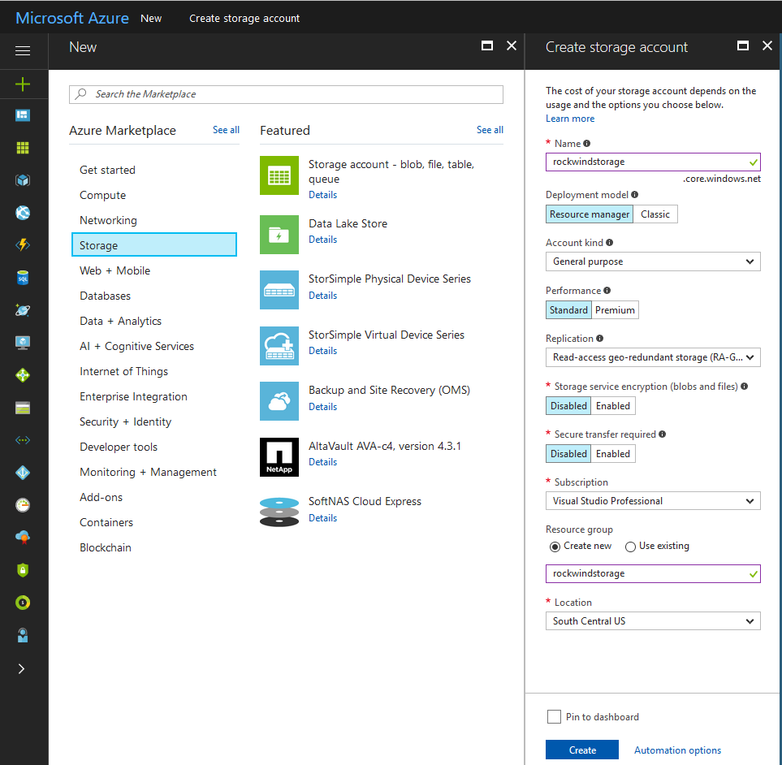
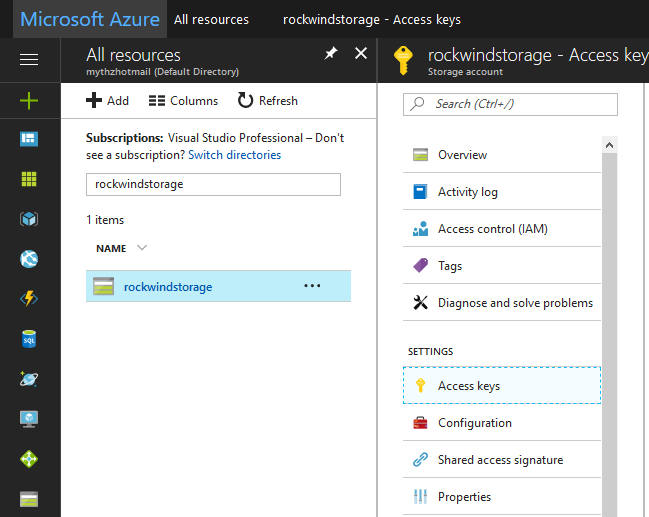
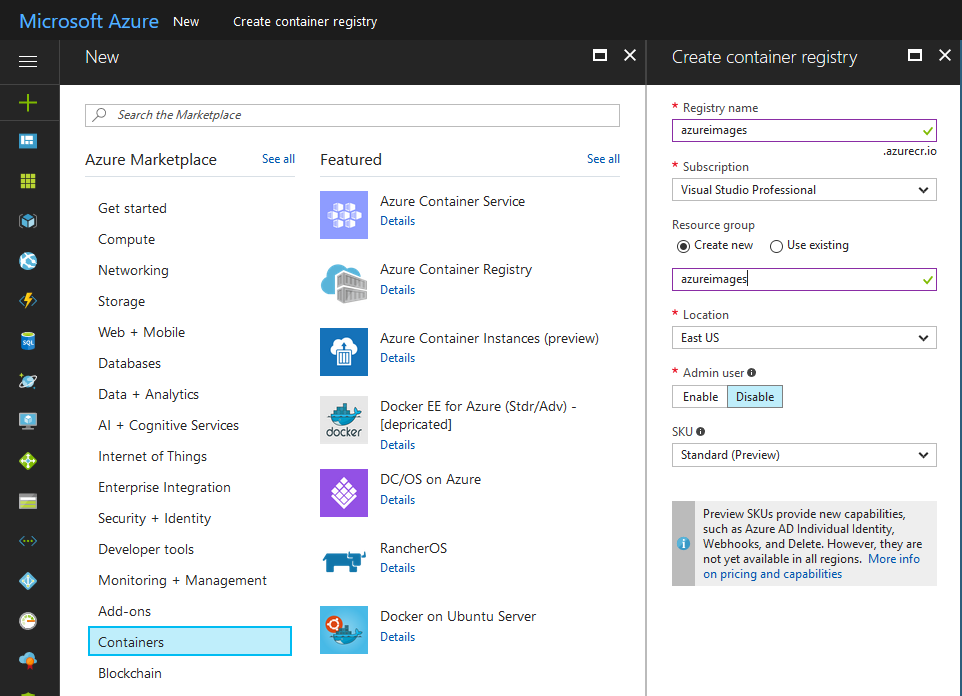
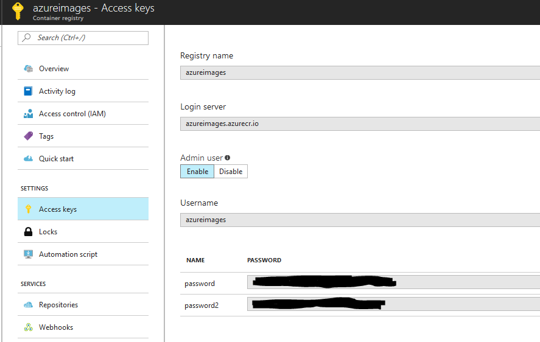
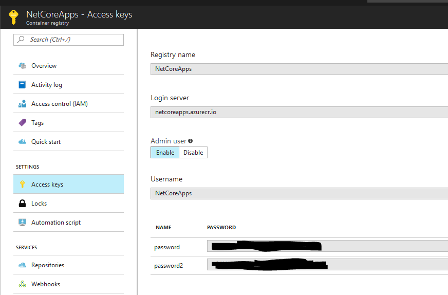
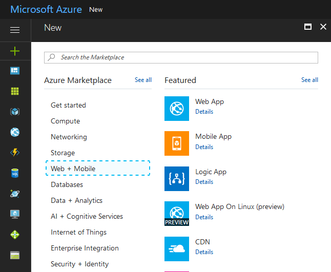
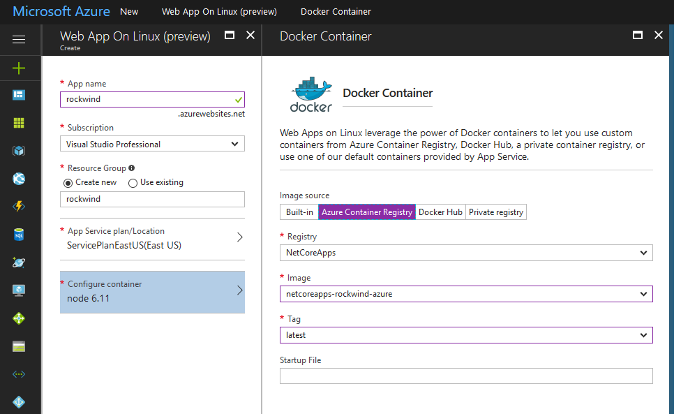
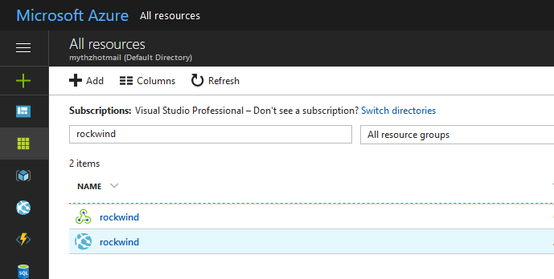
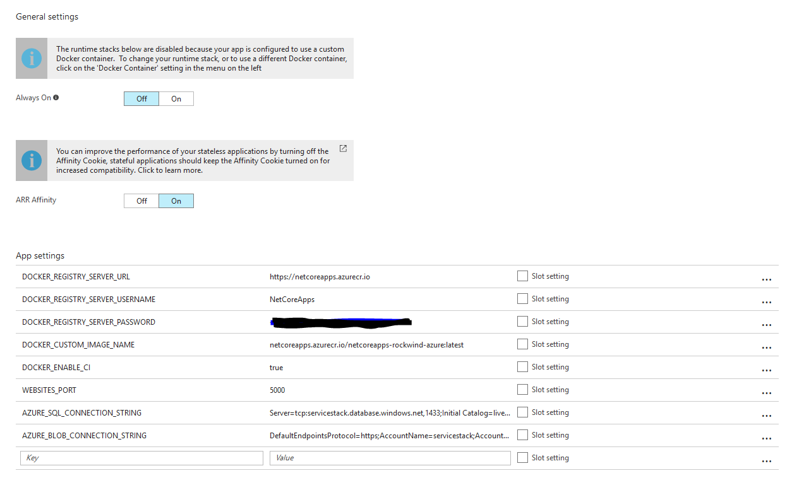

# rockwind-azure

rockwind-azure is a [Pure Cloud App](http://templates.servicestack.net/docs/web-apps#pure-cloud-apps) Rockwind example website running entirely on Azure

## Install

Run as a Desktop App (Windows only):

    $ dotnet tool install -g app

    $ app install rockwind-azure
    $ cd rockwind-azure && app app.sqlite.settings

Run as a .NET Core Web App (Windows, macOS, Linux):

    $ dotnet tool install -g web

    $ web install rockwind-azure
    $ cd rockwind-azure && web app.sqlite.settings

> Requires [.NET Core 2.1](https://www.microsoft.com/net/download/dotnet-core/2.1).

### Run on Azure

Rockwind Cloud Web App on Azure demostrates how to use ServiceStack templates, host static files on Azure Blob Storage and publish application as docker container to Azure Web Application.

## Prepare Azure to host application

To start application you need to do following things:

- Create Azure Blob Storage for holding web static files
- Create Azure Container Registry to keep application docker images
- Build and publish application docker image to Azure Container Registry 
- Create Azure Web Application from docker image hosted on Azure Container Registry

### Create Azure Blob Storage 

Select + on Azure Portal, select `Storage` and then `Storage account - blob, file, table, queue`. Fill up `Name` and `Resource Group` fields and click `Create` button.

After storage is created click on all resources and type storage name. You will find your newly created storage. Click on it and then on `Access keys` you'll see connection strings you need in next steps.

### Create Azure Container Registry

Azure Container Registry privately holds docker containers which can be used as containers storage source for Azure Web Applications. To create registry select `Containers` and `Azure Container Registry` fill up the name, resource group and enable admin access to the registry.

Open created registry and click on `Access Keys` tab. You will see registry username and password which will be used on next step when docker image will be pushed to the registry.

### Build and Publish Docker Image to Azure Registry

Repository contains scripts you can run to build and publish docker image on linux server. All scripts are located in `/scripts` directory. 

At first you need to add two environment variables into command line: AZURE_REGISTRY_USER and AZURE_REGISTRY_PASSWORD. To do it run the following command in command line:

    export AZURE_REGISTRY_USER=YourAzureUser
    export AZURE_REGISTRY_PASSWORD="YourAzurePassword"

Don't forget to enclose password into double quotes because default azure passwords often contain character which must be escaped in command line.

Also you need to edit `deploy-envs.sh` file and edit `AZURE_REGISTRY` variable to set it to the domain of your azure registry.

### Create Azure Web Application

Login to Azure Portal and click on plus button on the left pane. Select `Web + Mobile` chapter in Azure Marketplace and choose `Web App On Linux (preview)`

Fill up `App name` field, choose your Azure subscription and Service Plan, then click on `Configure Container`. You will see `Docker Container` form on the right side. Click on `Azure Container Registry` tab and choose registry which was created on previous step. Select image was published to that registry and tag. Leave `startup file` field empty. Then click on `Create` button 

 

Once web application is created you need to add environment variables to that application. At first you need to select your newly created application from other azure resources. To do it click on `All resources` button and type your web application name in search field. In our case it's `rockwind`. Select and click on it.

When you choose web application you can set up environment variables. You have to add 3 environment variables others are already added by Azure Portal when you create web application. These environment variables are:

- WEBSITES_PORT. If your web application uses port other than 80 you should add this environment variable and set it to the port exposed by application. Rockwind application uses port 5000.
- AZURE_SQL_CONNECTION_STRING. Connection string to your Azure SQL Database. To find it go to database settings and copy & paste connection string from there. Don't forget to replace placeholders for user and password in connection string to real user and password values.
- AZURE_BLOB_CONNECTION_STRING. This is connection string for Azure Blob Storage was created on the first step. To find it select your Azure Blob Storage in resources lists and click `Access keys`

Your set up is done you can stop and start your web application to update deployment from docker container. Navigate to URL `yourwebapp.azurewebsites.net` and in 3-4 minutes after docker container will be deployed you will see Rockwind.Azure application working.